# Shopping Assistant

## Index
- **[About](#about)**
- **[Features](#features)**
- **[Instructions for running locally](#Instructions-for-running-locally)**
   - **[Initial steps](#initial-steps)**
   - **[Method I (Using docker) [Recommended]](#method-i-using-docker-recommended)**
   - **[Method II (Without docker)](#method-ii-without-docker)**
- **[Demo video](#demo-video)**
- **[Screenshots](#screenshots)**
- **[Tech Stack](#tech-stack)**   
- **[File Structure](#file-structure)**
## About
Shopping Assistant is a chatbot, which can assist consumers in deciding the right product and bridge the gap between online and offline shopping. 

## Features
- Suggests products to the consumer depending upon his needs, just like a salesperson.
- Helps the consumer to virtually experience fashion products. E.g. If a consumer needs to try a T-shirt or a spectacle our shopping assistant gives him real time experience of how that product would look on him/her.
- Provides a summary of all the reviews about a product, which prevents users from doing the tedious job of going through hundreds of reviews of that product.

# Instructions for running locally

## Initial steps

1. Clone the repository by using the below command:

```
git clone https://github.com/shounak-max/shop-bot
```

2. Download the 4 model files from [here](https://drive.google.com/drive/folders/1nu6HFg_POr-wF24rAJEH-ZRCn7wtIpIo?usp=sharing) and copy them all to the directory `shopping-assistant/services/api/`. Please note that if you download the `model_files` folder in .zip format, then you need to extract all the files out of it and then copy them to the above directory. 

## Method I (Using docker) [Recommended]
### Pre-requisites

1. Install `Docker` by looking up the
   [docs](https://docs.docker.com/get-docker/)
2. Install `Docker Compose` by looking up the
   [docs](https://docs.docker.com/compose/install/)
```
Note: If you are using Windows, make sure Docker Desktop is running.
```

### Steps

1. Make sure you are in the root of the project (i.e., `./shopping-assistant/`
   folder).
2. Run `docker-compose up` to spin up the containers. If you are using Linux or Mac, you may need to use `sudo` for this command to work. 
3. `web-app` would then be available locally at http://localhost:3000 , `server`
   at http://localhost:8000 and the `API documentation` would be available at http://localhost:8000/redoc

## Method II (Without docker)
### Running the Server

0. If you don't already have `pipenv` installed, install it using the following commands:
```
pip install --upgrade setuptools wheel
pip install --user pipenv
```

1. Activate the virtual environment in the `api` folder by using the following command:

```
cd services/api
pipenv shell
```

2. In the activated virtual environment, run the following command to install all the dependencies:

```
pipenv install
```

3. In the activated virtual environment, run the following command to run the API:

```
uvicorn main:app
```

4. The `server` would run at http://127.0.0.1:8000/ and the `API documentation` would be available at http://127.0.0.1:8000/docs

### Running the Web App

1. Make sure you have `node` installed with version >= 14. Check using following command:

```
node -v
```

2. In the `web-app` folder, install all the dependencies using the following command:

```
cd services/web-app
npm install
```

3. In the web-app folder, run the React App using:

```
npm start
```

4. The web app would start running at http://localhost:3000
## Demo video

- Available at [https://www.youtube.com/watch?v=x_BFtcoaTks](https://www.youtube.com/watch?v=x_BFtcoaTks)
## Screenshots

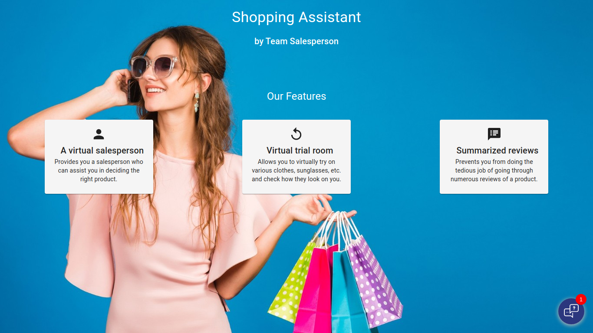
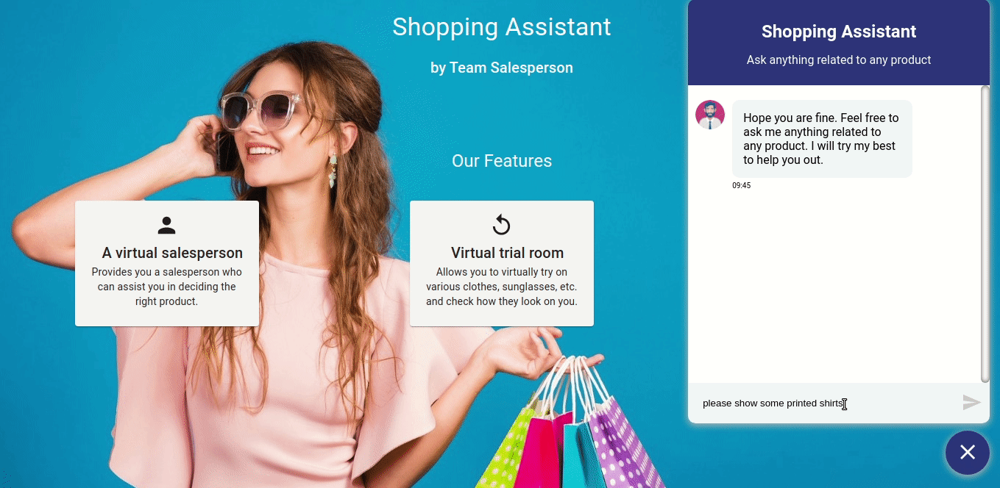
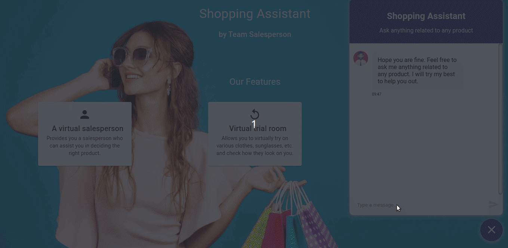
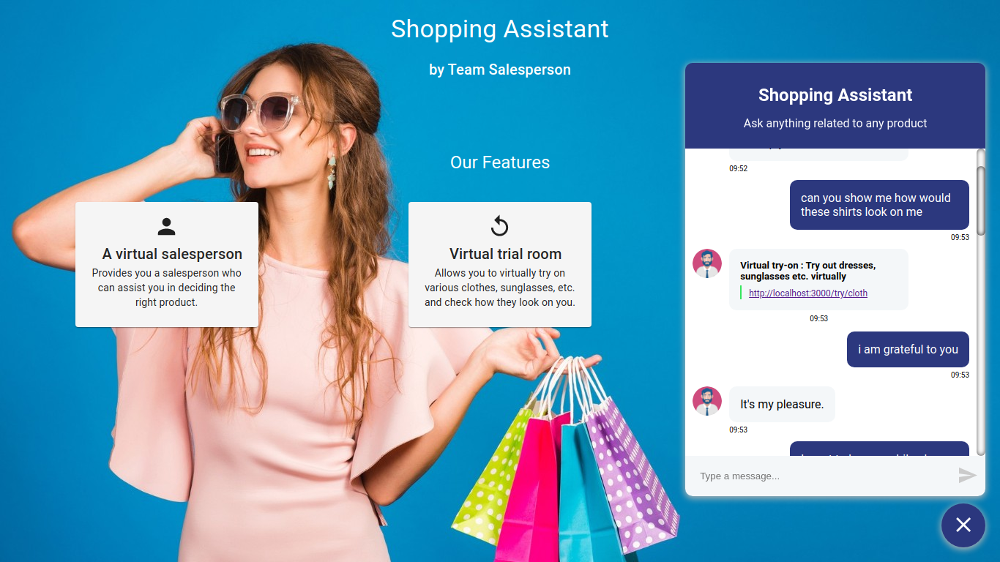
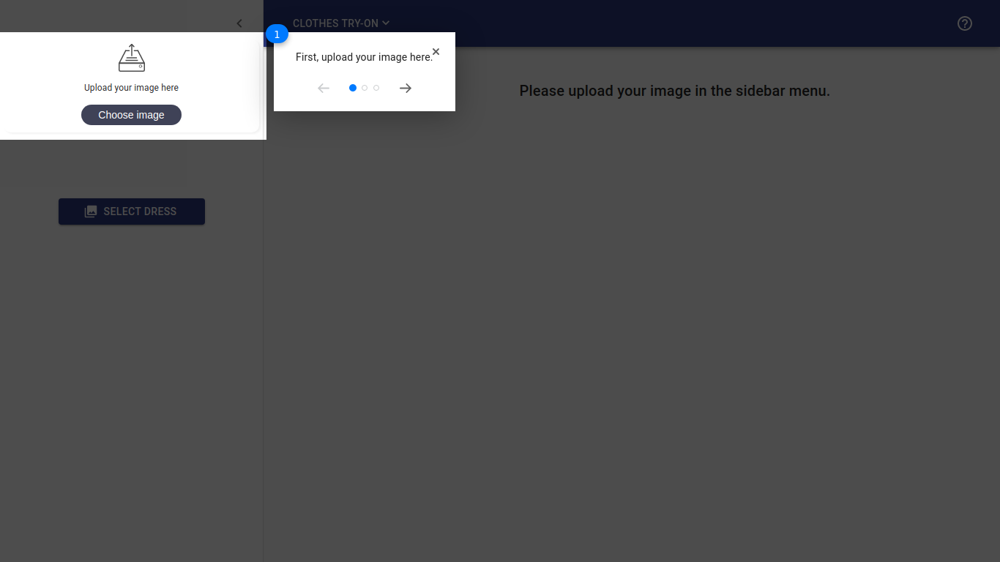
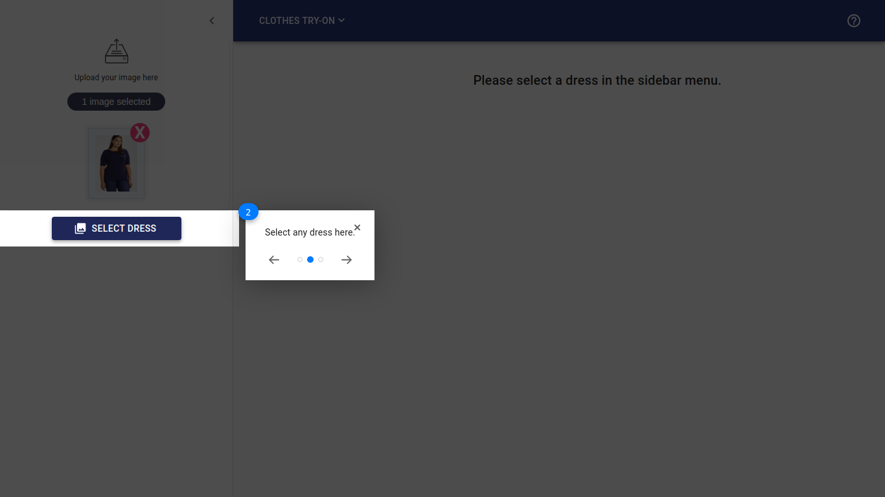
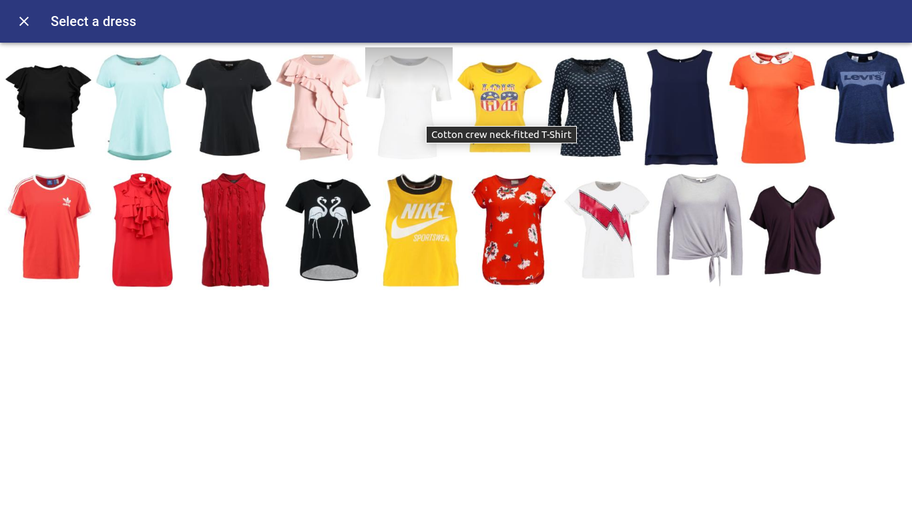
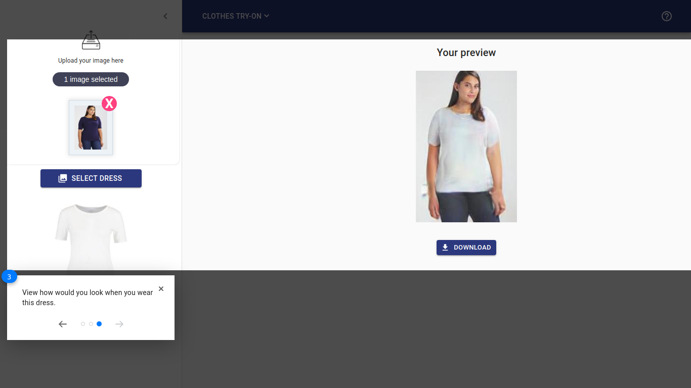
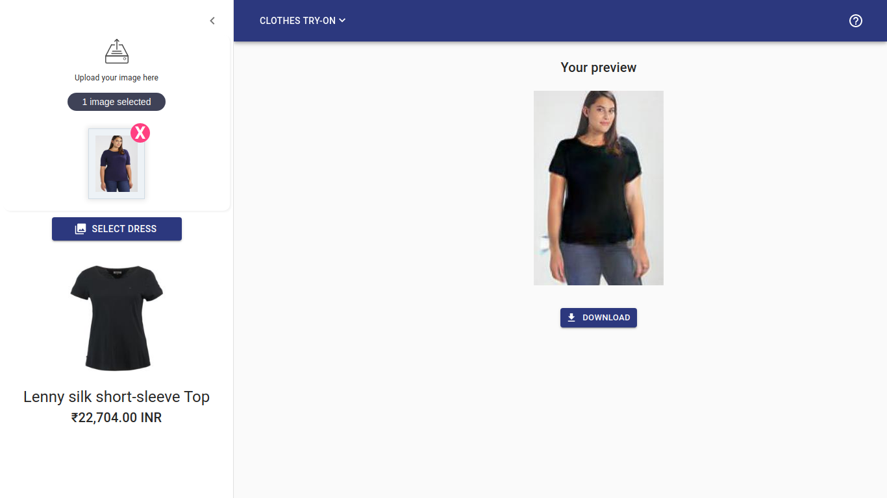
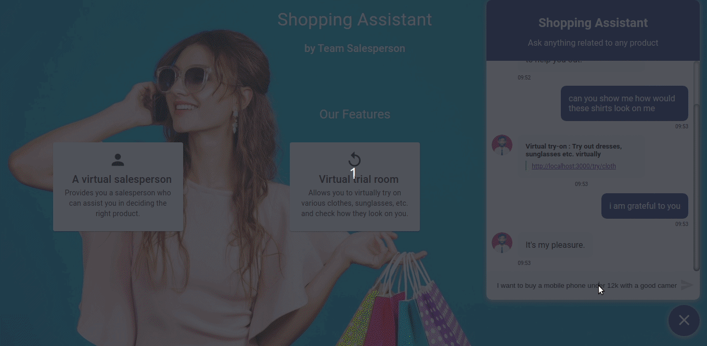

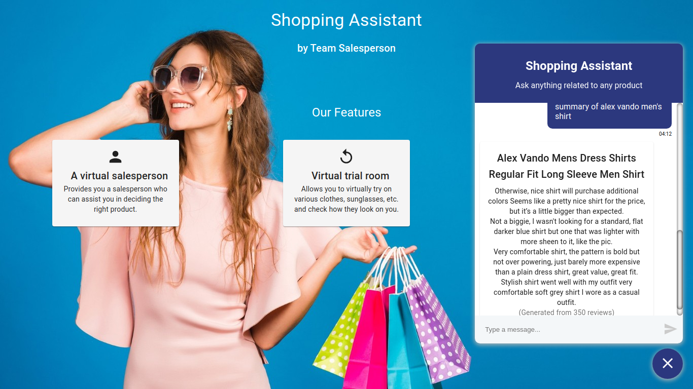
## Tech Stack

### Server

- [FastAPI](https://fastapi.tiangolo.com/#example)
- [Pytorch](https://pytorch.org/)
- [NLTK](https://www.nltk.org/)
### Web App

- [React.js](https://reactjs.org/docs/getting-started.html)
- [Jeeliz](https://github.com/jeeliz/jeelizGlassesVTOWidget)
### Others

- [Docker](https://www.docker.com/)

## File structure

- Presentation has been attached as `presentation.pdf`
- Screenshots have been attached in `screenshots/`
- Training files have been attached as `training-files/`
- Server code has been attached in `services/api/`
- Frontend code has been attached in `services/web-app/`
